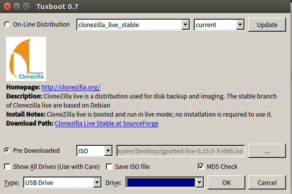

# 根目录扩容的办法

利用gparted-live制作启动盘进行扩容，由于我是在扩容完成之后才写的本文档，有些地方存在说明不详细的情况

### 实现步骤

1. 下载gparted-live（存放在我的百度网盘中）
2. 下载tuxboot
~~~
     sudo apt-add-repository ppa:thomas.tsai/ubuntu-tuxboot
     sudo apt-get update
     sudo apt-get install tuxboot
~~~
3. 插入U盘（必须为FAT32格式）并挂载，运行tuxboot 制作　gparted-live 镜像

选中　Pre Download 打开刚刚下载好的iso文件，点击ok开始制作

4. 制作完成后从U盘启动,进入gparted后对想要扩容的分区进行操作

